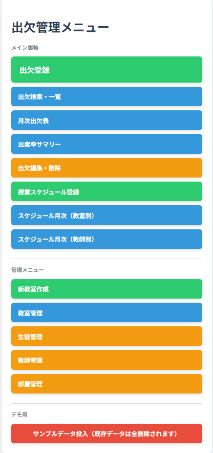
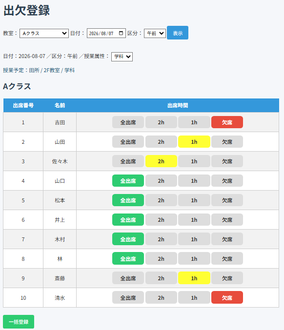
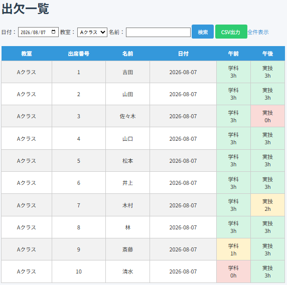
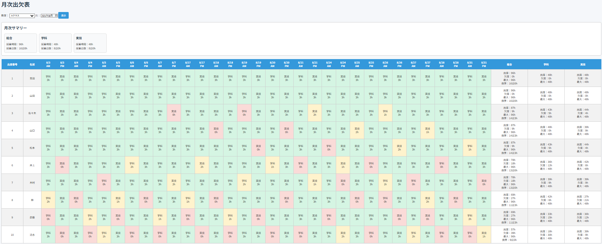
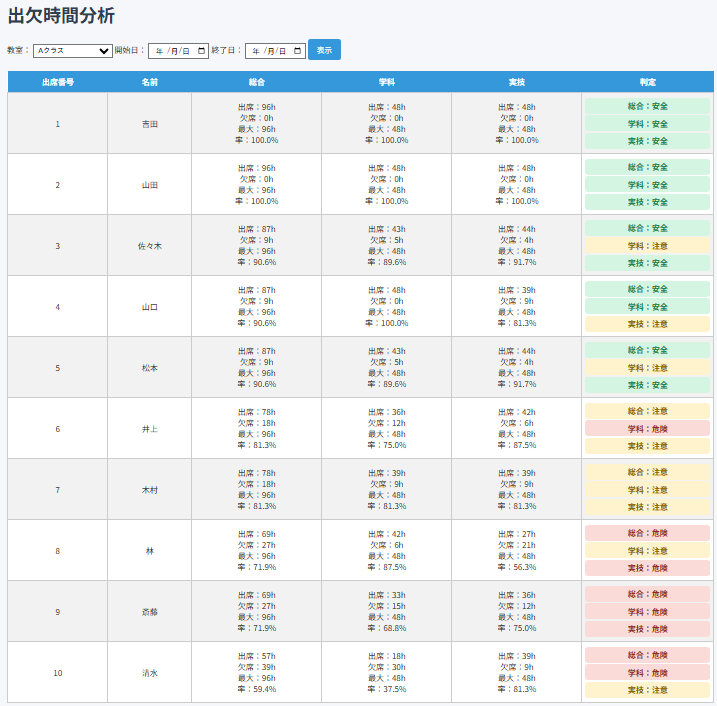
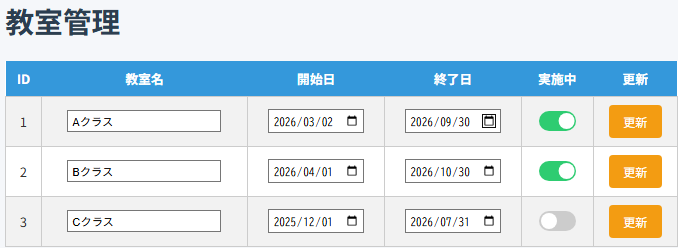
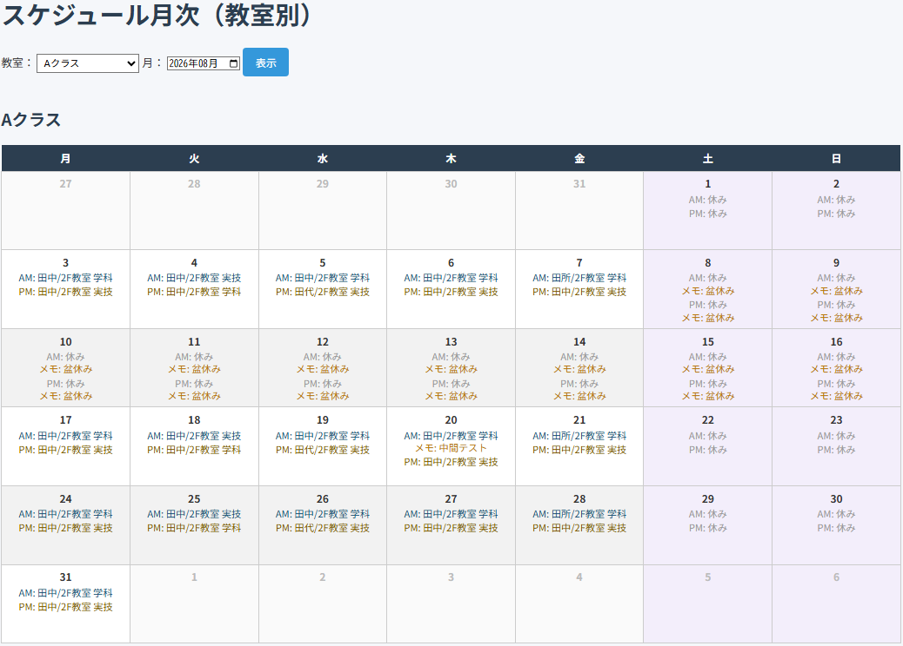
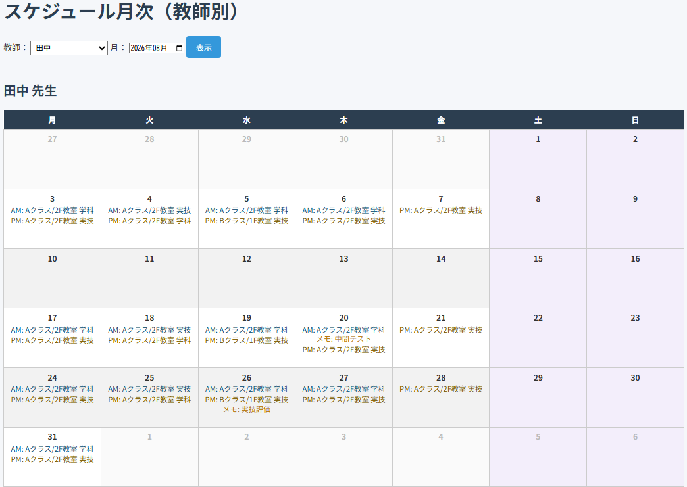
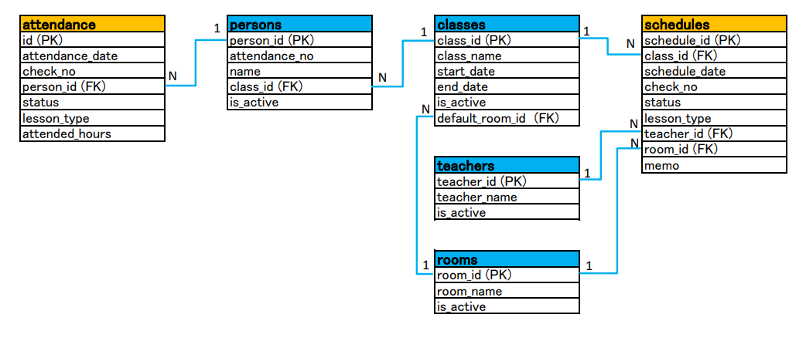

# 出欠管理システム（Spring Boot版）

職業訓練校向けの出欠管理システムです。Java / Spring Boot / Thymeleaf / SQLiteで作っています。

出欠の登録・検索・月次集計・出席率判定に加えて、授業スケジュール（教師・部屋の割当）の管理もできます。



## できること

- 教室・受講者・教師・部屋の登録・管理（登録/更新の結果はメッセージで表示。名前が空欄の場合は登録・更新せず理由を表示する）
- 教室、日付、午前/午後/補講ごとの出欠一括登録（登録済みデータがあれば選択状態を復元。補講はスケジュール未登録だと警告表示）
  - 午前/午後は1コマ3h、補講は1コマ1h想定。出席時間の選択肢もそれぞれ4択(3h/2h/1h/0h)・2択(1h/0h)に変わる
- 出席時間の登録（3h / 2h / 1h / 0h）、授業属性の登録（学科/実技）
- 出欠一覧の表示（日付・教室・名前で検索）
- 月次出欠表の表示（学科/実技/総合の出席時間集計、6h=1日換算）
- 出席率サマリー（学科/実技/総合ごとに安全/注意/危険を判定。コースの必要時間に対する消化率もあわせて表示）
- 登録済み出欠の編集・削除
- 授業スケジュール登録（週単位）
  - 縦軸：1週間×午前午後（14行）、横軸：クラス（コース）
  - 教師・使用場所・授業属性・コメントをコマごとに登録
  - 土日はデフォルトで「休み」、平日祝日は手動で切り替え可能
  - 台風などで急遽休みになった場合は「休講」を選択（理由のコメント入力必須）。休講は「休み」と違い、
    本来の教師・場所・属性をそのまま記録として残し、月次カレンダー（教室軸・教師軸とも）や
    出欠登録画面に「【休講】」付きで表示される
  - 画面上部のラジオボタンで「通常」（午前午後・14行）⇄「補講」（放課後のみ・7行）を切り替え表示。
    どちらも教師を選択したコマだけが登録される（未選択のコマは対象外）
  - 同じ教師・同じ場所が同じ時間帯に重複しないよう、DBのUNIQUE制約＋事前チェックで排他制御
  - 重複していた場合はその週全体を登録せず、該当セルを赤くハイライトして再入力を促す
- 授業スケジュールの月次一覧表示（教室軸・教師軸。補講が登録されている日は午前午後の下に追加表示）
- サンプルデータ投入（メニュー下部のボタン1つで、既存データを全部消して2026年8月分のデモデータを入れ直す。中身が空だと寂しいので用意した）

## 画面一覧

| URL | 内容 |
|---|---|
| `/` | メニュー |
| `/register` | 出欠登録 |
| `/list` | 出欠一覧 |
| `/monthly` | 月次出欠表 |
| `/summary` | 出席率サマリー |
| `/edit` | 出欠編集・削除 |
| `/schedule` | 授業スケジュール登録（週単位） |
| `/schedule/monthly` | スケジュール月次一覧（教室軸） |
| `/schedule/monthly/teacher` | スケジュール月次一覧（教師軸） |
| `/class/create` | 新教室作成 |
| `/classes` | 教室管理 |
| `/persons` | 受講者管理 |
| `/teachers` | 教師管理 |
| `/rooms` | 部屋管理 |
| `/sample-data/load`（POST） | サンプルデータ投入 |

## スクリーンショット

出欠登録



出欠一覧



月次出欠表



出席率サマリー



教室管理



スケジュール月次一覧（教室軸）



スケジュール月次一覧（教師軸）



## 使用技術

- Java 17
- Spring Boot（Spring Web, Thymeleaf, JDBC）
- SQLite（`sqlite-jdbc`ドライバ経由。JPA/Hibernateは不使用）
- Maven
- HTML/CSS

## アーキテクチャ

DBアクセスは全画面とも生JDBC（`Connection`/`PreparedStatement`/`ResultSet`のtry-with-resources）に統一しています。C#のADO.NET（`SqlConnection`/`SqlCommand`/`SqlDataReader`）とほぼ1対1で対応する書き方で、ORMやJdbcTemplateに頼らず接続の取得からクローズまでを自分で書き、DBアクセスの仕組みを隠さないことを優先しました（例外はDDL実行だけの`DatabaseInitializer`と、SQLファイルを流すだけの`SampleDataService`。この2つは単純なSQL実行の繰り返しなのでJdbcTemplateのままです）。

層構成は画面の性質で使い分けています。

- **3層(Controller/Service/Repository)**: `AttendanceRegister`/`AttendanceEdit`/`ScheduleRegister`/`ScheduleCalendar` — 出席/欠席の判定、重複チェックなど業務判断がある機能
- **2層(Controller/Repository、Service省略)**: `AttendanceList`/マスタ管理4系統(`ClassMaster`/`PersonMaster`/`TeacherMaster`/`RoomMaster`) — 業務判断の無い単純なCRUD。「名前が空欄なら登録・更新しない」という入力チェックはServiceを作らずController内のガード文で行い、結果は`RedirectAttributes`のフラッシュ属性で画面にメッセージ表示している
- **Controllerに直書き**: `AttendanceMonthly`/`AttendanceSummary` — DBの縦持ちデータを画面用に組み替える処理が複雑なため、層分けは今後の課題（[今後の追加予定](#今後の追加予定)参照）

クラス名は「画面の機能＋役割」が分かるように、出欠まわりは`Attendance`、スケジュール登録は`ScheduleRegister`を頭に付けています（月次カレンダー閲覧の`ScheduleCalendar`と、週単位登録の`ScheduleRegister`を区別するため）。

```
ScheduleRegisterController  … HTTPの受け取り、フォーム⇔業務データの変換、画面表示
ScheduleRegisterService     … 業務ロジック（教師・場所の重複チェック）
ScheduleRegisterRepository  … DBアクセス（生JDBC。週の入れ替えをJDBCのトランザクションで実行）
```

スケジュールの登録は「対象週×対象クラスの範囲をDELETEしてから、送信内容を全部INSERTし直す」入れ替え方式です。画面がその週の全コマを毎回まるごと送信してくるため、DB側も同じ範囲をまるごと入れ替えるのが一番シンプルで、セルを空に戻せばそのコマの取り消しもできます。DELETEとINSERTは`setAutoCommit(false)`〜`commit()`/`rollback()`のJDBCトランザクションで1つにまとめ、途中で失敗しても「消しただけ」の状態にならないようにしています。

重複チェックはアプリ側の事前チェック（分かりやすいエラー表示のため）に加え、最終的にはDBのUNIQUE制約が排他制御の担保になっています（アプリ側のチェックをすり抜けても、DBが確実に拒否する二重の安全策）。

## フォルダ構成

```text
attendance-system-java/
├── pom.xml
├── data/
│   └── attendance.db              … SQLiteのDBファイル（起動時に自動生成、Git管理外）
├── docs/
│   └── images/                    … READMEのスクリーンショット・ER図
├── src/main/java/com/example/attendance_system_java/
│   ├── AttendanceSystemJavaApplication.java
│   ├── DatabaseInitializer.java   … 起動時にテーブルが無ければ作成
│   ├── IndexController.java      … メニュー
│   │
│   │  （出欠まわり：Monthly/Summaryだけ層分け未対応）
│   ├── AttendanceRegisterController.java / AttendanceRegisterService.java / AttendanceRegisterRepository.java
│   ├── AttendanceEditController.java / AttendanceEditService.java / AttendanceEditRepository.java
│   ├── AttendanceListController.java / AttendanceListRepository.java
│   ├── AttendanceMonthlyController.java
│   ├── AttendanceSummaryController.java
│   │
│   │  （マスタ管理：ClassMaster〜/PersonMaster〜/TeacherMaster〜/RoomMaster〜で統一、全て2層）
│   ├── ClassMasterController.java / ClassMasterRepository.java
│   ├── PersonMasterController.java / PersonMasterRepository.java
│   ├── TeacherMasterController.java / TeacherMasterRepository.java
│   ├── RoomMasterController.java / RoomMasterRepository.java
│   │
│   │  （スケジュール：3層構成）
│   ├── ScheduleRegisterController.java / ScheduleRegisterService.java / ScheduleRegisterRepository.java
│   ├── ScheduleCalendarController.java / ScheduleCalendarService.java / ScheduleCalendarRepository.java
│   │
│   └── SampleDataController.java / SampleDataService.java  … サンプルデータ投入
└── src/main/resources/
    ├── application.properties
    ├── sample_data.sql            … サンプルデータ投入ボタンが読み込むSQL
    ├── static/style.css
    └── templates/
        ├── fragments/header.html  … 全ページ共通のナビゲーション
        ├── index.html, register.html, list.html, monthly.html, summary.html,
        │   edit.html, class_create.html, classes.html, persons.html,
        │   teachers.html, rooms.html
        └── schedule.html, schedule_monthly.html, schedule_monthly_teacher.html
```

## セットアップ

VS Codeで「Spring Boot Extension Pack」を導入した状態を想定しています。

### ターミナルから起動する場合

```powershell
cd JAVA_attendance_system\attendance-system-java
.\mvnw.cmd spring-boot:run
```

### VS CodeのSpring Boot Dashboardから起動する場合

左サイドバーの「Spring Boot Dashboard」パネルからプロジェクトを選び、▶ボタンで起動します。

起動後、ブラウザで `http://localhost:8080/` を開きます。

## DB概要

DBはSQLiteの `data/attendance.db` です。起動時（`DatabaseInitializer`）に、無ければテーブルを自動作成します。

SQLiteは外部キー制約が接続ごとにデフォルトOFFのため、`application.properties`の`spring.datasource.hikari.connection-init-sql=PRAGMA foreign_keys = ON`で、接続プール（HikariCP）が新しい接続を作るたびに有効化しています。



| テーブル | 内容 |
|---|---|
| `classes` | 教室/訓練クラス情報（`default_room_id`列でスケジュールの初期場所を、`required_academic_hours`/`required_practical_hours`列でコースの必要時間を保持） |
| `persons` | 受講者情報 |
| `attendance` | 日付・午前午後・受講者ごとの出欠情報 |
| `teachers` | 教師マスタ（`/teachers`画面から登録。起動直後は空） |
| `rooms` | 使用場所マスタ（`/rooms`画面から登録。起動直後は空） |
| `schedules` | 授業スケジュール（クラス・日付・午前午後ごとの教師・場所・属性・コメント） |

`schedules` テーブルには排他制御のための3つのUNIQUE制約があります。

```sql
UNIQUE (class_id, schedule_date, check_no)   -- 同じクラスの同じコマは1つだけ
UNIQUE (teacher_id, schedule_date, check_no) -- 同じ教師が同じ時間帯に2箇所に入れない
UNIQUE (room_id, schedule_date, check_no)    -- 同じ場所が同じ時間帯に二重予約されない
```

SQLiteのUNIQUE制約はNULL同士を別物として扱うため、「休み」の行（教師・場所がNULL）は何行あっても制約に引っかかりません。

「休講」は「休み」と違い、本来の教師・場所・属性をNULLにせずそのまま記録として残します（詳しくは[できること](#できること)参照）。これは「休講はその日全クラスを一斉に休講にする時にしか使わない」という運用を前提にしており、同じ時間帯に他クラスの「通常」授業が並行して存在しないため、UNIQUE制約に引っかかる心配はありません。特定クラスだけ休講にして教師・場所を別クラスへ回す運用を今後追加する場合は、この前提が崩れるため設計の見直しが必要です。

## 今後の追加予定

- **RepositoryのDIをインターフェース経由にしてから、テストコードを追加**：今はController/ServiceがRepositoryの具象クラスを直接注入しているため、本物のSQLiteを避けたテストが書けない。インターフェースに切り出せば、Springの差し替え可能なDIコンテナの仕組みをそのまま活かして、モック実装によるテストが書けるようになる
- `AttendanceMonthly`/`AttendanceSummary`の層分け（DBの縦持ちデータを画面用に組み替える処理をServiceへ切り出す）
- 帳票・データ出力機能（出欠一覧のCSV出力、スケジュール表の印刷対応、必要ならExcel出力）
- ログイン機能。その後、休み・早退の申請・承認フォーム（承認は「誰が承認したか」の記録が要るためログイン機能が前提）
